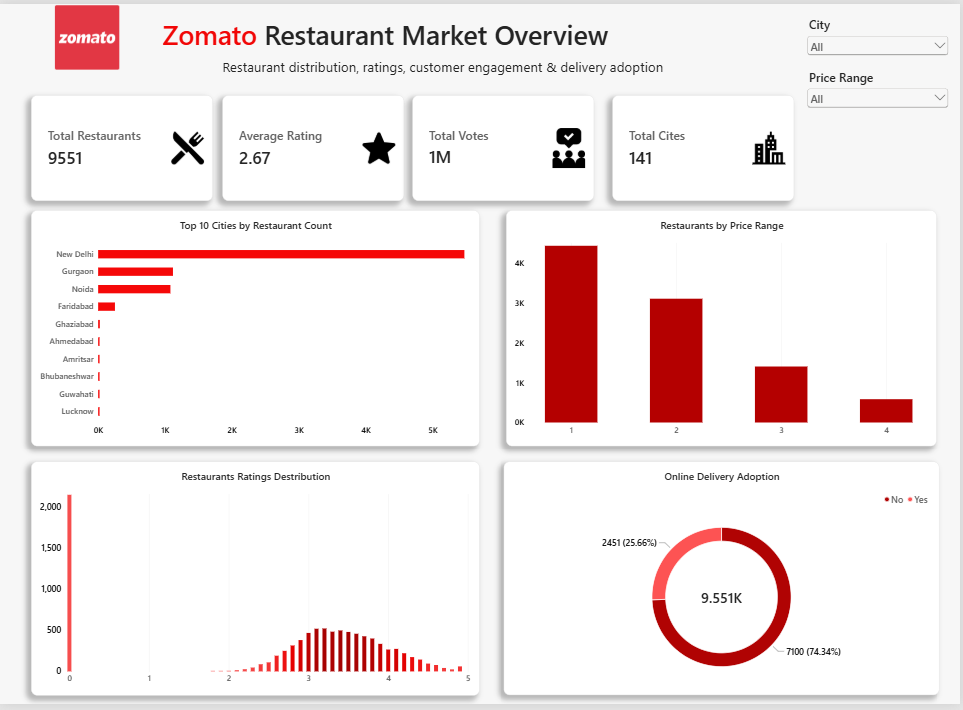
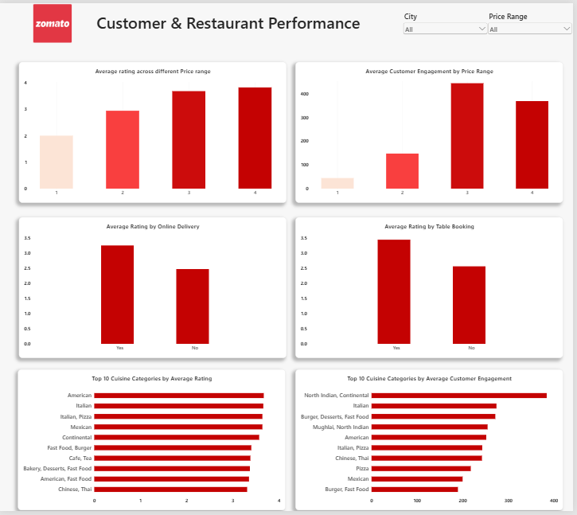
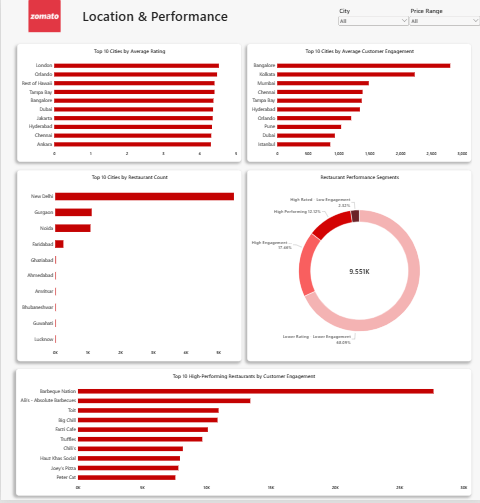

## Key Business Insights

The analysis identified several important patterns related to restaurant pricing, ratings, customer engagement, delivery adoption, table booking, cuisine performance, and city-level markets.

Some key findings include:

- Higher price ranges are associated with higher average ratings.
- Price Range 3 has the highest average customer engagement.
- Restaurants offering online delivery show higher average ratings and engagement.
- Table booking is strongly associated with higher ratings and customer engagement.
- Bangalore has the highest average customer engagement among cities with at least 10 restaurants.
- 22.49% of restaurants are unrated in the dataset.
- 1,158 restaurants are classified as high-performing based on the project's analytical thresholds.

[View Detailed Business Insights](Insights/business_insights.md)

## Power BI Dashboard

### Market Overview

### Customer & Restaurant Performance

### Location & Performance

